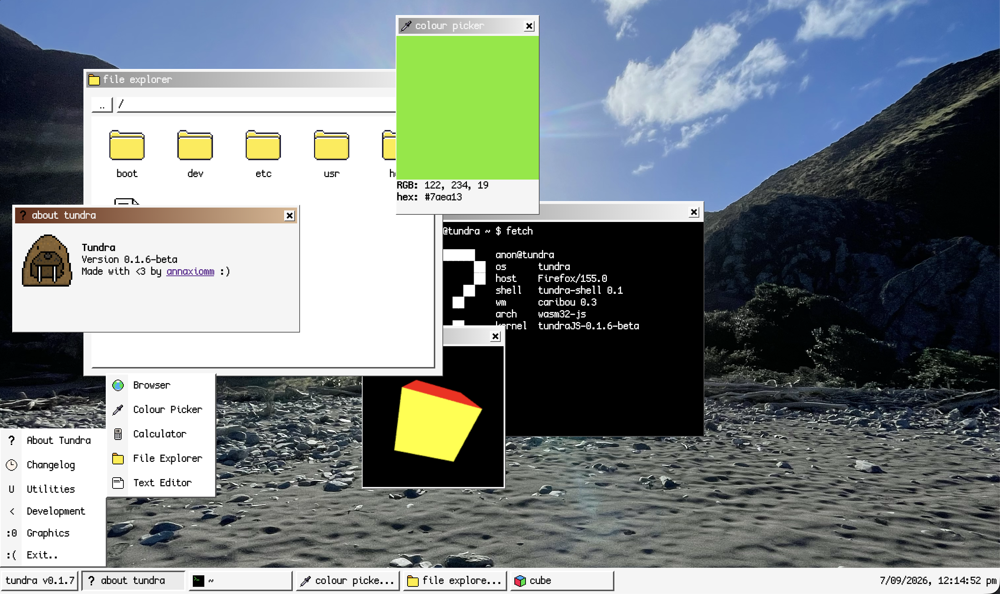

# tundra
an entire (?) operating system localised entirely within your browser!

## features
- a nice welcome
- a notes app with a TODO list and a changelog
- a collection of images taken by [yours truly](https://github.com/annaxiomm)
- and thats it so far, but many more are to come soon !
## credits
- [hack club](https://hackclub.com) for inspiring me to make this
- [the-moonwitch](https://github.com/the-moonwitch) for their lovely font "Cozette"
- [cooki studios](https://cookistudios.com) for the amazing nightingale meme
- [chatgpt](https://chatgpt.com) for emotional support when things go wrongs
